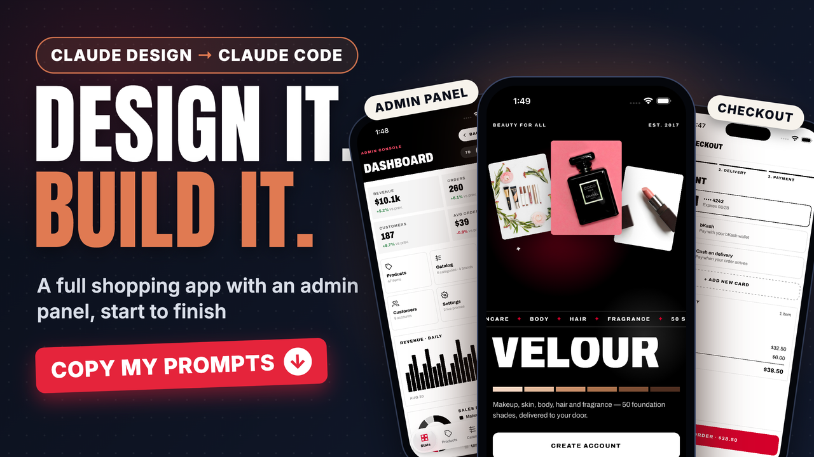

<div align="center">

<a href="https://www.youtube.com/@reactjsbd" target="_blank" title="Watch the full build on the ReactJS BD YouTube channel">
  
</a>

<sub>▶️ <b>Click the cover to watch the full build on <a href="https://www.youtube.com/@reactjsbd">ReactJS BD on YouTube</a></b></sub>

# Velour: Claude Design → Claude Code

**A complete beauty shopping app with an admin panel, built with React Native and Expo from a single Claude Design export and one prompt.**


</div>

---

## Table of contents

- [What's in this repo](#whats-in-this-repo)
- [What you'll build](#what-youll-build)
- [Prerequisites](#prerequisites)
- [Quick start (5 steps)](#quick-start-5-steps)
- [📋 Copy my prompts](#-copy-my-prompts)
- [Running the app](#running-the-app)
- [Tips for working with Claude Code](#tips-for-working-with-claude-code)
- [Troubleshooting](#troubleshooting)
- [Use your own design](#use-your-own-design)

---

## What's in this repo

This repo is the **starting point**, not the finished app. It holds the design and the instructions. Claude Code writes the code.

```
velour-mobile-app/
├── README.md                         ← you are here
├── PRD.md                            ← the build prompt / product requirements
├── cover.png
└── velour-beauty-shop-app/           ← Claude Design handoff bundle
    ├── README.md                     ← instructions for coding agents
    └── project/
        ├── Velour Beauty App v4.dc.html   ← ⭐ the main design (all screens)
        ├── Velour Beauty App v3.dc.html   ← earlier iterations (for reference)
        ├── Velour Beauty App v2.dc.html
        ├── Velour Beauty App.dc.html
        ├── catalog.js                ← product catalog data (names, BDT prices, shades)
        ├── support.js                ← Claude Design runtime
        ├── image-slot.js             ← image placeholder component
        └── ios-frame.jsx             ← iPhone frame used in the prototype
```

| File | Purpose |
| --- | --- |
| `Velour Beauty App v4.dc.html` | The design Claude Code builds from: every screen, color, font, and component. |
| `catalog.js` | Real product data that becomes the app's mock JSON. |
| `PRD.md` | The stack, rules, and definition of done that Claude Code follows. |

## What you'll build

A production-quality **React Native + Expo** app with two sides:

**🛍️ Shopper app**
- Welcome, sign in / sign up, and forgot password
- Home with a category marquee (Makeup · Skincare · Body · Hair · Fragrance · Gifts)
- Shop and product list with grid/list views and filters
- Search
- Product detail with shade picker
- Wishlist
- Cart → 3-step checkout (Bag → Delivery → Payment: card, bKash, cash on delivery)
- Orders and order detail
- Profile, saved addresses, payment methods, and help

**🛠️ Admin panel**
- Dashboard (revenue, orders, customers, AOV, daily revenue chart, sales breakdown)
- Products with a product editor
- Catalog
- Orders with an order detail view
- Customers with a customer detail view
- Settings and the More menu

**Stack:** Expo SDK (latest) · Expo Router · TypeScript (strict) · NativeWind · expo-image · Reanimated · Gesture Handler · expo-linear-gradient · expo-font (Archivo) · Zustand · mock JSON data

**Design tokens:** monochrome black and white (`#000000`, `#FFFFFF`, greys `#595959` / `#8C8C8C` / `#D6D6D6`), a signature red accent (`#D4002A`), and the **Archivo** typeface.

## Prerequisites

| Tool | Version | Check |
| --- | --- | --- |
| [Node.js](https://nodejs.org) | 20 LTS or newer | `node -v` |
| [Git](https://git-scm.com) | any | `git --version` |
| [Claude Code](https://docs.claude.com/en/docs/claude-code/overview) | latest | `claude --version` |
| Claude plan | Pro, Max, Team, or Enterprise (or an API key) | n/a |
| [Expo Go](https://expo.dev/go) on your phone | latest | *or* the iOS Simulator (Xcode, macOS) / Android Emulator |

Install Claude Code if you don't have it:

```bash
# macOS / Linux / WSL
curl -fsSL https://claude.ai/install.sh | bash

# or with npm
npm install -g @anthropic-ai/claude-code
```

## Quick start (5 steps)

### 1. Clone the repo

```bash
git clone https://github.com/noorjsdivs/velour-mobile-app.git
cd velour-mobile-app
```

### 2. Start Claude Code in the project folder

```bash
claude
```

The first time, Claude Code asks you to log in with your Claude account. Run it from the **repo root** so it can see both `PRD.md` and the design bundle.

### 3. (Optional) Plan first

Press **`Shift + Tab`** until you see **plan mode**. Claude reads the design and proposes a plan without changing any files, which is a good way to review the screen list before anything is built.

### 4. Paste the build prompt

Copy the **[main build prompt](#1-the-main-build-prompt)** below and paste it into Claude Code. Then let it work: it reads the design, lists every screen and token, scaffolds the Expo app, and builds screen by screen.

> ⏱️ This is a big build. Expect a long session with many file edits. Approve the permission prompts as they appear, or use auto-accept mode (`Shift + Tab`) if you're comfortable with that.

### 5. Run it

```bash
npx expo start
```

Scan the QR code with **Expo Go**, or press **`i`** for the iOS Simulator or **`a`** for the Android Emulator.

---

## 📋 Copy my prompts

### 1. The main build prompt

This is the content of [`PRD.md`](./PRD.md), with the design path pointing at the bundle's real location. Paste it into Claude Code as-is.

```text
Read velour-beauty-shop-app/project/Velour Beauty App v4.dc.html completely — it's a
Claude Design export containing every screen, flow, color, font and component of a
mobile app called Velour Beauty. Also read every file it imports (support.js,
catalog.js, image-slot.js). Grep through it if it's large; do not skip screens.

Build this as a production-quality React Native app with Expo in this directory.

Stack (use the latest stable versions of everything, verify with npm before
installing): Expo SDK (npx create-expo-app@latest, blank TypeScript template),
Expo Router for file-based navigation, TypeScript strict, NativeWind for styling,
expo-image, react-native-reanimated, react-native-gesture-handler, expo-linear-gradient,
expo-font with the fonts from the design, Zustand for state, and mock JSON data
for products/services. Use `npx expo install` for every Expo-managed package so
versions match the SDK.

Rules:

- First list every screen, navigation flow, and design token you found in the
  file, then build. Match the design pixel-for-pixel: exact hex colors, font
  sizes, spacing, radii, shadows, icons, tab bar, headers, cards, buttons, inputs.
- Extract all tokens into a single theme file (constants/theme.ts + tailwind.config).
- Reusable components in /components, screens in /app using Expo Router groups
  (auth, tabs, modals as they appear in the design).
- Every screen must be reachable via real navigation, with working interactions
  (tabs, back, cart/favorites/booking state, forms with validation).
- Handle safe areas, keyboard, loading/empty states, and dark mode if the design
  shows it.
- No placeholder screens, no TODOs. If a screen is in the design, it exists and
  works.
- When done, run `npx expo-doctor` and `npx tsc --noEmit` and fix all issues,
  then give me a screen-by-screen summary of what was built and how to run it
  with `npx expo start`.
```

> 💡 **Shortcut:** you can also just type `Follow PRD.md exactly. The design lives in velour-beauty-shop-app/project/.`

### 2. Follow-up prompts (use as needed)

**Audit against the design**
```text
Go through Velour Beauty App v4.dc.html screen by screen and compare each one with
what you built. List every mismatch in color, spacing, font size, radius, icon or
copy, then fix them all.
```

**Make sure nothing is missing**
```text
List every screen and every go('...') navigation target in the design file, and
confirm each one exists in /app and is reachable by tapping through the app. Build
anything that's missing.
```

**Verify the admin panel**
```text
Walk the admin panel flow end to end: dashboard → products → edit product → orders
→ order detail → customers → customer detail → settings. Make sure every admin
screen matches the design and the data updates through Zustand.
```

**Final quality pass**
```text
Run npx expo-doctor and npx tsc --noEmit, fix every warning and error, remove any
unused code, and confirm there are no TODOs or placeholder screens left.
```

---

## Running the app

```bash
npx expo start            # dev server + QR code
npx expo start --ios      # open in the iOS Simulator
npx expo start --android  # open in the Android Emulator
npx expo start -c         # clear the Metro cache (fixes most odd bugs)
```

Health checks:

```bash
npx expo-doctor           # checks dependency versions against the SDK
npx tsc --noEmit          # type-checks the whole project
```

## Tips for working with Claude Code

| Do this | Why |
| --- | --- |
| Run `/init` after the first build | Creates a `CLAUDE.md` so future sessions know your stack and conventions. |
| Use **plan mode** (`Shift + Tab`) for big changes | You review the plan before any file changes. |
| Ask for one screen at a time when fixing details | Smaller tasks give more precise results. |
| Paste screenshots straight into the terminal | Claude can compare your simulator against the design visually. |
| Use `/clear` between unrelated tasks | Keeps the context focused. |
| Commit after each working milestone | `git commit` gives you a safe point to roll back to. |
| Press `Esc` to interrupt, `Esc Esc` to rewind | Steer the work as soon as it goes off track. |

## Troubleshooting

<details>
<summary><b>Claude can't find the design file</b></summary>

The design is at `velour-beauty-shop-app/project/Velour Beauty App v4.dc.html` (not `design/…`). Make sure you started `claude` from the repo root, and use the prompt above, which already points to the correct path.
</details>

<details>
<summary><b>The design file is too large to read in one go</b></summary>

`v4` is about 370 KB. Ask Claude to *"read it in chunks and grep for every screen key before building."* It will page through the file.
</details>

<details>
<summary><b>NativeWind styles aren't applying</b></summary>

Run `npx expo start -c` to clear the cache. Then check that `babel.config.js`, `metro.config.js`, and `global.css` are set up following the NativeWind docs for your installed version. You can also ask Claude: *"NativeWind classes aren't applying, check the setup."*
</details>

<details>
<summary><b>Version mismatch warnings from expo-doctor</b></summary>

Run `npx expo install --fix`, then run `npx expo-doctor` again.
</details>

<details>
<summary><b>Fonts look wrong</b></summary>

The design uses **Archivo** (variable width and weight). Ask Claude to load it with `@expo-google-fonts/archivo` and to hold the splash screen until the fonts finish loading.
</details>

## Use your own design

This workflow works for any app:

1. Design your app in [**Claude Design**](https://claude.ai/design).
2. Export it as a handoff bundle and drop it into an empty repo.
3. Copy `PRD.md` from this repo and change the file name, app name, and stack.
4. Run `claude` and paste the prompt.

---

<div align="center">

### 🎥 Watch the full walkthrough

<a href="https://www.youtube.com/@reactjsbd" target="_blank">
  
</a>

If this helped you, **⭐ star the repo** and **subscribe** for more Claude Code builds.

<sub>Design by Claude Design · Code by Claude Code · Product data adapted from fentybeauty.com for demo purposes only</sub>

</div>
